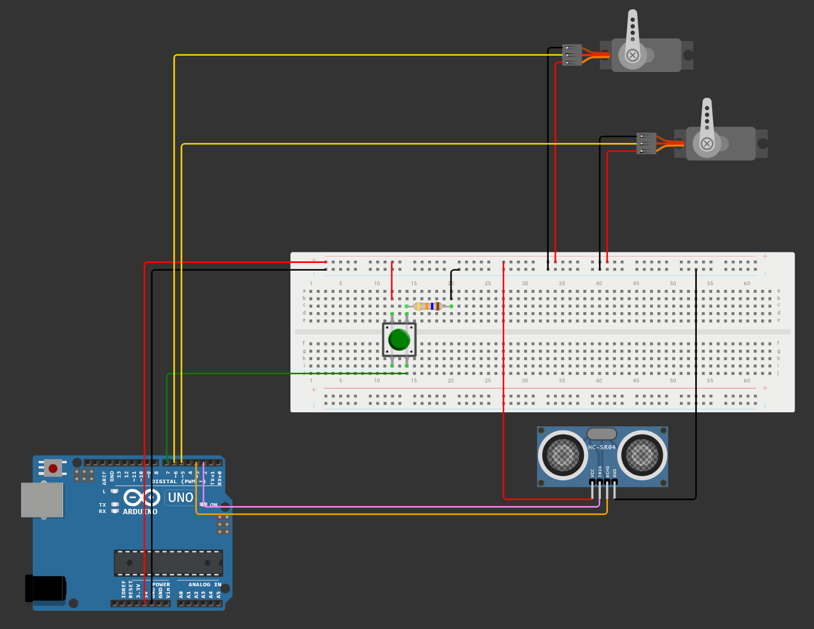

# SALSA (Smart Adaptative Lightweight Shutter Automation)

## Description
Smart Adaptative Lightweight Shutter Automation (SALSA) est une solution qui vous permet d'automatiser et programmer l'ouverture et fermeture de vos volets à bois facilement, et à moindre coût.

## Auteurs
- Ninon AUTEFAGE PINIES
- Daphné NAVRATIL
- Alexandre PERROT
- Yige YANG

# Installation du projet

Ce repértoire contient trois éléments :
- Le code Arduino
- Le serveur central en Python
- Le site Internet

Il est nécessaire d'avoir une version Python >=3.11 et d'avoir installé Arduino IDE pour pouvoir modifier des variables d'environnement et le téléverser à l'Arduino.

Le site Internet peut être installé sur n'importe quel serveur Web au choix (XAMPP, Apache...)

# Configuration du projet
La carte Arduino étant équipé d'un module Wi-Fi, il est nécessaire de configurer le point d'accès Wi-Fi et d'y mettre l'adresse IP du serveur Python.

Modifier le fichier WIFI_ARDUINO.ino à la ligne 8, 9 et 11 tel que :
```c
const char* ssid     = "NOM_WIFI";     
const char* password = "MOT_DE_PASSE";    

const char* serverIP = "X.X.X.X"; // Mettre l'IP du serveur Python
const int serverPort = 5000; // Port du serveur Python, par défaut 5000
```

Le serveur Python doit également connaître une clé API de OpenWeatherMap et l'adresse IP de la carte Arduino, modifier le fichier server.py à la ligne 13 et 21 tel que 

```py
API_KEY = "OPENWEATHERMAP_API_KEY" # Mettre une clé API de OpenWeatherMap
# ...
ARDUINO_IP = "X.X.X.X" # Mettre l'adresse IP de l'Arduino, voir dans le Serial Monitor à 9600 baud sur Arduino IDE pour connaître son adresse IP dès qu'il est connecté à la Wi-FI
```

Le site Web ne requiert pas de configuration particulière.

# Schéma de montage


# Vidéo de démonstration
https://github.com/user-attachments/assets/e2e2f413-e6f0-4f66-9d13-1a7c279633c4


